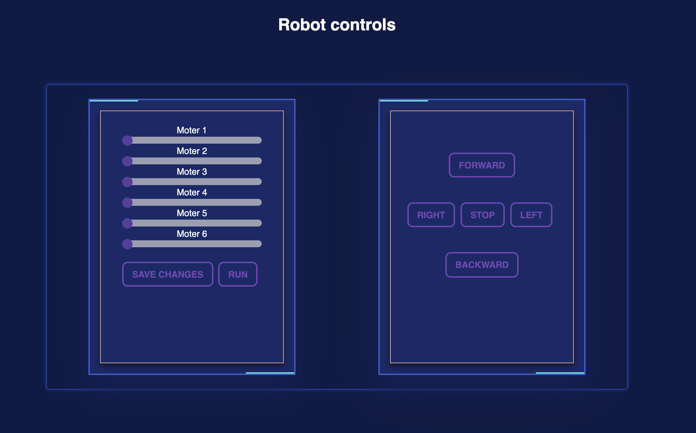

# Robot-Arm-controllers

## Discription
this project was an interface to help control a robot arm with 6 motors is supposed to :

- send the degree of each motor to a database 
- send the direction to a datebase
- "save changes" button  will save each one into the database 
- "run" will retrieve the last saved data from the database
- is compatible for mobile 

## Technologies used 
- HTML
- CSS
- JavaScript
- MySQL

## Credits

this project used:

[css template](https://codepen.io/uiswarup/pen/RBByzW)
